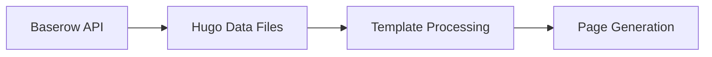

# Static Messenger Documentation

## Table of Contents

### Part 1: Non-Technical Guide
1. [Introduction](#introduction)
2. [What is Static Messenger?](#what-is-static-messenger)
3. [Features for Content Creators](#features-for-content-creators)
4. [Getting Started](#getting-started)
5. [Creating Content](#creating-content)
6. [Managing Characters](#managing-characters)
7. [Working with Messages](#working-with-messages)
8. [Tips and Best Practices](#tips-and-best-practices)

### Part 2: Technical Documentation
1. [Architecture Overview](#architecture-overview)
2. [Database Structure](#database-structure)
3. [API Integration](#api-integration)
4. [Build Pipeline](#build-pipeline)
5. [Message System](#message-system)
6. [Character System](#character-system)
7. [File Management](#file-management)
8. [Development Setup](#development-setup)
9. [Troubleshooting](#troubleshooting)

---

# Part 1: Non-Technical Guide

## Introduction

Welcome to Static Messenger! This guide will help you understand how to use the platform to create engaging character-based conversations and interactive stories.

## What is Static Messenger?

Static Messenger is a platform that allows you to:
- Create interactive character conversations
- Build branching storylines
- Share messages with images and interactive buttons
- Manage character profiles and avatars
- Schedule message releases

## Features for Content Creators

### Character Management
- Create unique characters with names and nicknames
- Upload and manage character avatars
- Track message history per character
- Build character relationships

### Message Creation
- Write regular dialogue messages
- Create system announcements
- Hide secret messages for special triggers
- Add up to three interactive buttons per message
- Include images with messages

### Content Organization
- Chronological message ordering
- Character-based message grouping
- Timeline views of conversations
- Easy content updates

## Getting Started

1. **Account Setup**
   - Request access to the platform
   - Receive your content creator credentials
   - Log in to the management interface

2. **Basic Navigation**
   - Characters section: Manage your cast
   - Messages section: Create and edit conversations
   - Media library: Store and manage images
   - Timeline view: See your content flow

## Creating Content

### Setting Up Characters
1. Navigate to the Characters section
2. Click "New Character"
3. Fill in:
   - Character name
   - Nickname (optional)
   - Upload an avatar
4. Save your character

### Creating Messages
1. Go to Messages section
2. Click "New Message"
3. Choose:
   - Character speaking
   - Message type (regular/system/secret)
   - Write your message
   - Add images (optional)
   - Set up buttons (optional)
4. Set send date
5. Save and preview

### Using Interactive Buttons
1. Enable buttons in message creation
2. Add button text
3. Link to follow-up messages
4. Preview the interaction flow

## Managing Characters

### Character Profiles
- Keep character information consistent
- Update avatars when needed
- Monitor message count
- Review character timeline

### Best Practices
- Use consistent naming
- Keep character voice unique
- Plan character interactions
- Regular content updates

## Working with Messages

### Message Types
1. **Regular Messages**
   - Normal character dialogue
   - Day-to-day conversations
   - Story progression

2. **System Messages**
   - Announcements
   - Story updates
   - Global notifications

3. **Secret Messages**
   - Hidden content
   - Special reveals
   - Easter eggs

### Content Planning
- Plan message sequences
- Schedule content releases
- Create conversation branches
- Review and update content

## Tips and Best Practices

### Content Creation
- Write naturally
- Plan interaction points
- Use images effectively
- Test button flows

### Organization
- Label content clearly
- Group related messages
- Plan content ahead
- Regular backups

### Common Pitfalls to Avoid
- Inconsistent character voice
- Dead-end conversations
- Missing image alternatives
- Unclear button choices

---

# Part 2: Technical Documentation

## Architecture Overview

Static Messenger is built on a hybrid architecture that combines static site generation with a dynamic database backend:

```
[Baserow Database] <---> [Hugo Build Process] ---> [Static Site] <---> [User Interface]
     |                          |                        |
     |                          |                        |
[Character Data]          [Data Fetching]         [Interactive Elements]
[Message Data]           [Page Generation]        [Message Display]
[Media Files]            [Asset Processing]       [Character Profiles]
```

### Key Components
- **Baserow Backend**: Handles data storage and relationships
- **Hugo Engine**: Processes data and generates static pages
- **Frontend Layer**: Manages user interactions and display
- **Build Pipeline**: Orchestrates the generation process

## Database Structure

### Messages Table (ID: 787)
Stores all message-related data with the following schema:

| Field ID | Name | Type | Description |
|----------|------|------|-------------|
| field_6527 | ID | autonumber | Auto-incrementing identifier (read-only) |
| field_6529 | characterlink | array | Links to characters table |
| field_6531 | avatar | array | Avatar image (read-only lookup field) |
| field_6532 | message | string | Message content |
| field_6533 | msgType | integer/string | Message type (secret/system) |
| field_6534 | Image | array | Message image attachments |
| field_6535 | Send-Date | date | Accepts a date in ISO format |
| field_6536 | Posted | boolean | Message posted status |
| field_6537 | button1 | boolean | First button enabled |
| field_6538 | button 1 text | string | First button text |
| field_6539 | button2 | boolean | Second button enabled |
| field_6540 | button 2 text | string | Second button text |
| field_6541 | button3 | boolean | Third button enabled |
| field_6542 | button 3 text | string | Third button text |
| field_6550 | nickname | array | Character nickname (lookup field) |

### Characters Table (ID: 788)
Manages character information and relationships:

| Field ID | Name | Type | Description |
|----------|------|------|-------------|
| field_6543 | name | string | Character name |
| field_6545 | avatar | array | Character avatar image |
| field_6546 | Messages Count | array | Count of messages (lookup) |
| field_6547 | messages | integer | Message count |
| field_6548 | messages - linkedtable | array | Linked messages |
| field_6549 | nickname | string | Character nickname |

## API Integration

### Authentication
The API uses token-based authentication. Include your token in all requests:

```javascript
const headers = {
    Authorization: "Token YOUR_DATABASE_TOKEN"
};
```

### Base URL
```
https://showcase.newhideaway.com
```

### Message Operations

#### List Messages
```javascript
GET /api/database/rows/table/787/
```

#### Get Single Message
```javascript
GET /api/database/rows/table/787/{row_id}/
```

#### Create Message
```javascript
POST /api/database/rows/table/787/
Content-Type: application/json

{
    "characterlink": [1],
    "message": "Message content",
    "msgType": 1,
    "Image": [{
        "name": "image_filename.png"
    }],
    "Send-Date": "2023-12-16T12:00:00Z",
    "Posted": true,
    "button1": true,
    "button 1 text": "Option 1",
    "button2": false,
    "button 2 text": "",
    "button3": false,
    "button 3 text": ""
}
```

#### Update Message
```javascript
PATCH /api/database/rows/table/787/{row_id}/
Content-Type: application/json

{
    "message": "Updated content",
    "Posted": true
}
```

#### Delete Message
```javascript
DELETE /api/database/rows/table/787/{row_id}/
```

### Character Operations

#### List Characters
```javascript
GET /api/database/rows/table/788/
```

#### Get Single Character
```javascript
GET /api/database/rows/table/788/{row_id}/
```

#### Create Character
```javascript
POST /api/database/rows/table/788/
Content-Type: application/json

{
    "name": "Character Name",
    "avatar": [{
        "name": "avatar.png"
    }],
    "nickname": "Nickname",
    "messages - linkedtable": [1, 2, 3]
}
```

## Build Pipeline

### 1. Data Fetching Phase


1. **Initial Setup**
   - Configure API token
   - Set up Hugo environment
   - Initialize build parameters

2. **Data Collection**
   - Fetch all characters
   - Retrieve messages
   - Download media assets
   - Process relationships

3. **Data Processing**
   - Sort messages chronologically
   - Group by character
   - Process message types
   - Prepare button configurations

### 2. Generation Phase

1. **Template Processing**
   ```
   /layouts/
   ├── _default/
   │   ├── single.html    # Single message template
   │   └── list.html      # Message list template
   ├── characters/
   │   └── profile.html   # Character profile template
   └── partials/
       ├── message.html   # Message component
       └── buttons.html   # Button component
   ```

2. **Asset Pipeline**
   - Image optimization
   - Avatar processing
   - Static asset compilation
   - Resource bundling

3. **Page Generation**
   - Character profiles
   - Message threads
   - Timeline views
   - Index pages

### 3. Post-Processing
- Link validation
- Asset verification
- Cache generation
- Performance optimization

## Message System

### Message Types
1. **Regular Messages**
   - Standard character dialogue
   - Support for text and images
   - Optional button interactions

2. **System Messages** (ID: 4754)
   - Special notifications
   - System announcements
   - Status updates

3. **Secret Messages** (ID: 4753)
   - Hidden content
   - Conditional triggers
   - Special formatting

### Button System
Each message can have up to three interactive buttons:
```javascript
{
    "button1": true,
    "button 1 text": "Option A",
    "button2": true,
    "button 2 text": "Option B",
    "button3": false,
    "button 3 text": ""
}
```

### Message Flow
1. **Creation**
   - Data validation
   - Character linking
   - Media processing
   - Button setup

2. **Processing**
   - Type classification
   - Relationship mapping
   - Timeline positioning
   - Button logic implementation

3. **Display**
   - Template rendering
   - Media loading
   - Button interaction
   - State management

## File Management

### File Upload Methods

1. **Direct Upload**
```javascript
const formData = new FormData();
formData.append('file', fileObject);

axios({
    method: "POST",
    url: "/api/user-files/upload-file/",
    headers: {
        Authorization: "Token YOUR_DATABASE_TOKEN",
        "Content-Type": "multipart/form-data"
    },
    data: formData
});
```

2. **URL Upload**
```javascript
axios({
    method: "POST",
    url: "/api/user-files/upload-via-url/",
    headers: {
        Authorization: "Token YOUR_DATABASE_TOKEN",
        "Content-Type": "application/json"
    },
    data: {
        "url": "https://example.com/image.png"
    }
});
```

### File Response Format
```json
{
    "url": "https://files.baserow.io/user_files/example.png",
    "thumbnails": {
        "tiny": {
            "url": "...tiny.png",
            "width": 21,
            "height": 21
        },
        "small": {
            "url": "...small.png",
            "width": 48,
            "height": 48
        }
    },
    "name": "example.png",
    "size": 229940,
    "mime_type": "image/png",
    "is_image": true,
    "image_width": 1280,
    "image_height": 585,
    "uploaded_at": "2023-12-16T12:00:00Z"
}
```

## Development Setup

### Prerequisites
1. Hugo Extended Version (latest)
2. Node.js 16+
3. Baserow API access token

### Local Development
1. Clone the repository
2. Install dependencies:
   ```bash
   npm install
   ```
3. Configure environment:
   ```bash
   cp .env.example .env
   # Edit .env with your API token
   ```
4. Start development server:
   ```bash
   hugo server -D
   ```

### Build Process
1. Production build:
   ```bash
   hugo --minify
   ```
2. Test build:
   ```bash
   hugo -D --baseURL="http://localhost"
   ```

## Troubleshooting

### Common Issues

1. **API Authentication Errors**
   - Verify token validity
   - Check token permissions
   - Ensure proper header format

2. **Build Failures**
   - Check Hugo version compatibility
   - Verify template syntax
   - Validate data structure

3. **Media Issues**
   - Confirm file permissions
   - Check upload size limits
   - Verify supported formats

### Debug Tools
1. Hugo Server with Debug:
   ```bash
   hugo server --debug
   ```
2. API Response Logging:
   ```javascript
   axios.interceptors.response.use(
       response => {
           console.log('API Response:', response);
           return response;
       },
       error => {
           console.error('API Error:', error);
           return Promise.reject(error);
       }
   );
   ```

### Support Resources
- [Hugo Documentation](https://gohugo.io/documentation/)
- [Baserow API Reference](https://baserow.io/docs/apis%2Fdatabase)
- Project Issue Tracker: [GitHub Issues](https://github.com/your-repo/issues) 